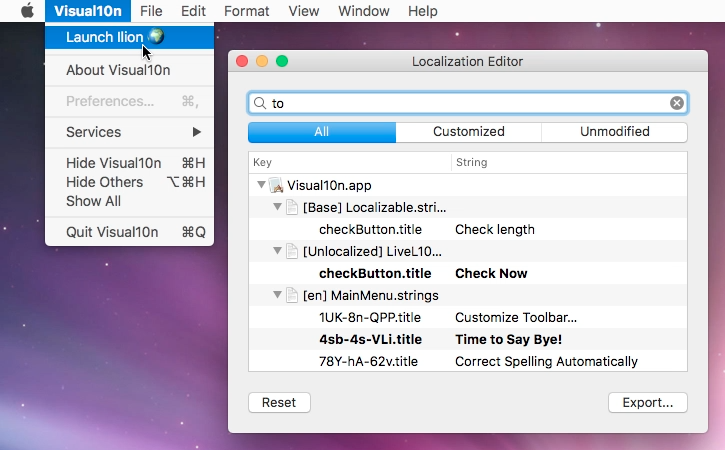

# Ilion

Ilion is (going to be) a localization helper tool for macOS that cuts the lengthy translate-build-verify loop by allowing for run-time localization adjustments.



### About the name

Ilion stands from i(nstant)-localization (l10n), but the name also makes reference to the ancient city of Troy, which the Greeks infiltrated by means of the famous Trojan Horse trick.

### What is it good for?

Ilion's purpose is to allow for near-live app localization on macOS. This means that localized strings can be added, removed, or changed run-time, without having to rebuild the project. In some cases, the app should be relaunched in order to see the changes, but sometimes not even that is necessary. Translators who have been suffering from lack of context can now have something real to play with. Checking whether the resizing behavior is properly configured for a text UI element or iterating on a translation until it fits-- all these can now be done with almost instant feedback using Ilion.

### How does it work

Ilion needs to be built into the target application. When the app is launched, the framework intercepts calls to `NSLocalizedString` and proxies them to a string database built from the `.strings` resources and the previously set overrides. This database can then be accessed and modified via the Ilion UI.

### Installation

1. Grab the [latest release](releases) or build the framework yourself if you will. 
2. Add the `Ilion.framework` to your app target
3. Make sure to include the framework in a _Copy Files_ build phase with _Frameworks_ set as destination

That's it! Ilion will take care of the rest when your app is launched (namely, it will inject a menu item into the application menu if it finds one). If you want to prevent Ilion from tampering with the menu, you can set the boolean `IlionSuppressMenu` flag to `YES` in your app's `Info.plist`.

Alternatively, you may as well invoke the Ilion UI manually as follows:

```swift
import Ilion
...
func launchIlion() {
    Ilion.shared.start()
}
```

or in ObjC:

```objc
#import <Ilion/Ilion-Swift.h>
...
- (void)launchIlion {
    [[Ilion shared] start];
}
```

### Requirements

macOS 10.10

### Limitations

- only `.strings` files and UI base localization are supported (that is, one XIB + many strings files)
- changes are only preserved on the machine they have been made on
- changes cannot be exported or committed back to the original resources

### Planned improvements

- export changes to file
- support for XLIFF files
- integration with cloud-based translation services

### License

MIT License