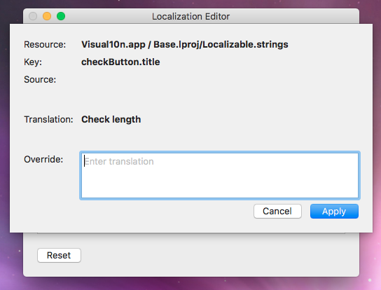

# Getting Started

This document is an end-user focused walkthrough of Ilion and its features.

### What is Ilion?

Ilion is a localization helper tool that cuts the lengthy translate-build-verify loop by allowing for run-time localization adjustments. 

### How is it going to help my work?

- Have you ever wanted to check whether the resizing/word wrapping behavior is properly configured for a label if the text starts to grow? 
- Or to iterate on a translation until it fits the designated space? 
- Have you ever suffered from not knowing the context for a copy because the developers didn't provide you with screenshots? 
- Have you ever dreamt of live translating on desktop, just like on the web?

If you have answered yes to any of the questions above, I have good news for you: Ilion got you covered.

But before we dive deeper, let me drag you back into reality:

### What Ilion is not?

Ilion is not (yet) a replacement for the user interface of cloud-based localization services (e.g. Transifex). The strings you change while running the app will not get synced back to the server or saved into the application. If you copy the application to another machine, the modified strings won't follow. So imagine it as an isolated sandbox where you can play around but cannot alter anything in the outside world.

### Basic usage

For Ilion to work, it needs to be explicitly enabled by the developers when the app is built. This usually means that you'll have to ask for a custom build instead of using the publicly released versions.

When you launch the app, you'll notice that in the application menu there is a new menu item named _Launch Ilion_:

Clicking the menu item brings up the Ilion browser window:

This window shows all the modifiable copies in the application for all enabled languages. The rows in bold indicate the copies you have already modified. Use the search field to filter the list. You can also adjust whether you want to see all matching copies, just the ones you have already customized, or the yet untouched ones.

Once you find the entry you are looking for, doubleclick on the row (or select it and hit Return) to open the edit panel.

In this panel you can see some metadata about the copy being edited. Here, _Key_ is just an identifier developers use to refer to this string in the code. _Translation_ is the actual text that will be shown to the users, and this is what you can replace by filling out the _Override_ field. When you are done, hit Apply to commit the changes.

Note: to revert to the original copy, it is not sufficient to clear the text field. Instead, you should go back to the browser window, select the entry from the list, and press Backspace. If you want to start over from scratch, use the _Reset_ button to trash all previous changes.

**IMPORTANT:** Changes made to copies are never immediately reflected on the app UI. E.g. if you are customizing texts in a dialog, you'll have to close and reopen the dialog to see the updated texts. Customizing other parts of the application (e.g. the main menu) may even require restarting the app for changes to take effect. This is a known limitation.

