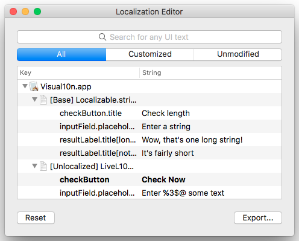
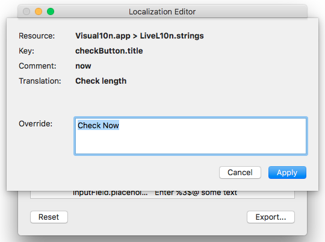
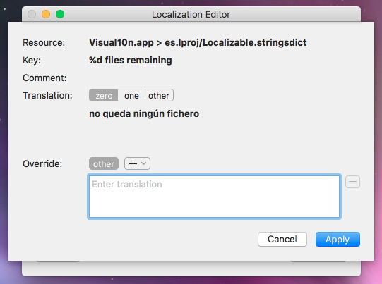

# Getting Started

This document is an end-user focused walkthrough of Ilion and its features.

### What is Ilion?

Ilion is a localization helper tool that cuts the lengthy translate-build-verify loop by allowing for run-time localization adjustments. 

### How is it going to help my work?

- Have you ever wanted to check whether the resizing/word wrapping behavior is properly configured for a label if the text starts to grow? 
- Or to iterate on a translation until it fits the designated space? 
- Have you ever suffered from not knowing the context for a copy because the developers didn't provide you with screenshots? 
- Have you ever dreamt of live translating on desktop, just like on the web?

If you have answered yes to any of the questions above, I have good news for you: Ilion got you covered.

But before we dive deeper, let me drag you back into reality:

### What Ilion is not?

Ilion is not (yet) a replacement for the user interface of cloud-based localization services (e.g. Transifex or Smartling). The strings you change while running the app will not get synced back to the server or saved into the application. If you copy the application to another machine, the modified strings won't follow. So imagine it as an isolated sandbox where you can play around but cannot alter anything in the outside world.

### Basic usage

For Ilion to work, it needs to be explicitly enabled by the developers when the app is built. This usually means that you'll have to ask for a custom build instead of using the publicly released versions.

#### Browsing strings

When you launch the app, you'll notice that in the application menu there is a new menu item named _Launch Ilion_:

Clicking the menu item brings up the Ilion browser window:

This window shows all the modifiable copies in the application for all enabled languages. The rows in bold indicate the copies you have already modified. Use the search field to filter the list. You can also adjust whether you want to see all matching copies, just the ones you have already customized, or the yet untouched ones.

#### Editing strings

Once you find the entry you are looking for, doubleclick on the row (or select it and hit Return) to open the edit panel.

In this panel you can see some metadata about the copy being edited. Here, _Key_ is just an identifier developers use to refer to this string in the code. _Comment_ is an optional hint that the developers may have attached to this entry to aid the translation by giving some context. _Translation_ is the actual text that will be shown to the users, and this is what you can replace by filling out the _Override_ field. When you are done, hit Apply to commit the changes.

Note: to revert to the original copy, it is not sufficient to clear the text field. Instead, you should go back to the browser window, select the entry from the list, and press Backspace. If you want to start over from scratch, use the _Reset_ button to trash all previous changes.

**IMPORTANT:** Changes made to copies are never immediately reflected on the app UI. E.g. if you are customizing texts in a dialog, you'll have to close and reopen the dialog to see the updated texts. Customizing other parts of the application (e.g. the main menu) may even require restarting the app for changes to take effect. This is a known limitation.

### Exporting changes

Ilion now supports exporting the app's string resources with all the changes that have previously been applied. For this, hit _Export..._ in the bottom right corner of the browser window.

You are then presented with a file dialog where you can select the directory to save the resources to. When exporting is finished, the exported files will be revealed in the Finder.

### Advanced topics

#### Plurals

Ilion currently offers experimental support for plural forms. If a string has been localized with plurals enabled, the edit panel will show a plural rule selector to let you browse through all defined plural rules:

Plural-enabled strings, too, can be overridden with a single text entry but you can also choose to specify various plural forms for the override. To do so, use the [+] add button in the _Override_ section to add a new plural rule, then enter the desired text. 

To remove an unwanted override, use the [&minus;] remove button next to the text field.

When you are done editing, hit Apply to save the changes. 

Note that overrides with multiple plural forms will not get combined with the original translation. That is, if the original copy had `zero`, `one`, and `other` forms and you only specify `other` in the override, the resulting copy will not get the `zero` and `one` behaviors. On the other hand, even if the original copy only specified `other`, you can freely add more rules as needed which will be taken into account (provided the developers did a decent job setting up the UI).

#### Format strings

Format strings are copies that contain variables. These variables usually appear as a sequence of special characters (e.g. `%3$@`) and are meant to be inserted as-is or omitted altogether. Since these placeholders are very prone to accidental typos, Ilion makes some effort to save you from trouble by presenting them as indivisible entities that you can copy or drag-and-drop from the original translation:

Caveats:

- the variable tokens themselves don't come with a leading and trailing space so make sure you add that yourself when needed
- you can reference numbered entities (e.g. `%2$@`) an arbitrary number of times in the same copy, but the same is not true for unnumbered variables (e.g. `%d`). When closing the edit panel, Ilion will warn you in case of any such mistakes.
- typing variables manually is still supported, although discouraged

